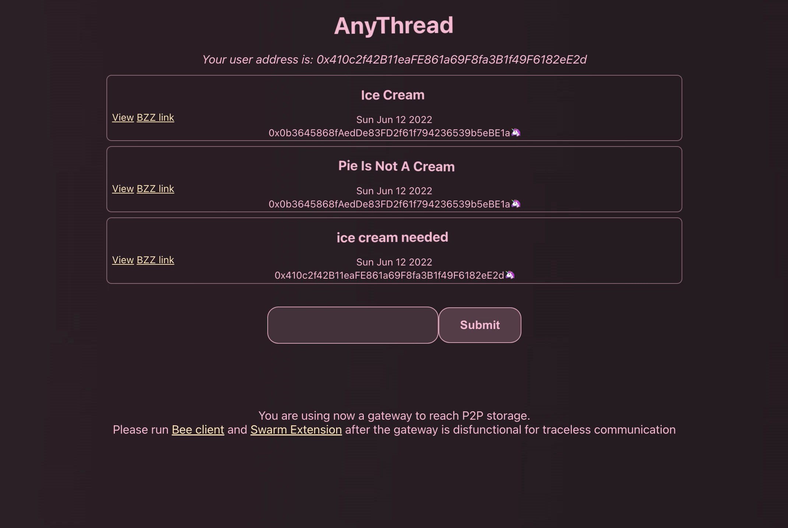

# What is AnyThread?

Global link: [https://anythread.bzz.link](https://anythread.bzz.link)

Latest content address:
  * Swarm hash: 2f3987574ddaa1c5b9dd6f5da09dbf0f7ca9834ec7b27fc76f2514fa56c5abca
  * CID: bah5acgzaf44yov2n3kq4loo5n5o2bhn7b56kta2oy6zh7r3peukpuvwfvpfa

## Inspiration

The current web2 forums for discussion hold data in siloses, under control of predominantly large providers. The data is under their control to be removed, sometimes lost for the authors alltogether. You cannot migrate the data to another provider, hence you are locked in to an ecosystem. On the other hand, data that seldom accessed takes up storage, taking up energy and limited resources.

As decentralized technologies evolve, that does not have to be the case. AnyThread is a proof of the concept of holding the communication in decentralized storage, making it always available to the authors and other users.

## What it does

AnyThread allows a thread of comments to emerge on a specific topic, with anyone being allowed to comment on it; or comment on a comment - and so on. It does allow this to be done pseudononimously, as the comments are tied to a keys of a user.

## What tech is used

AnyThread is using Swarm decentralized storage for the topics and comments to them. Swarm acts as immutable storage for the comment threads. The nature of storage allows for garbage collection of non-popular content after a period of time, making this kind of solution also more sustainable in the long run. 

## What's next for AnyThread

The future is bright for AnyThread as a technology. Communities can be built around the ideas, with some extra business logic added on top and allowing for filtering based on tastes, friends, etc. As anyone could swith the "frontend" providers at any time, adoption should not be stimyed by fear of lockin, and network effects on the scale never seen before can be achieved.

## License

TBD

## Short video of using [AnyThread](https://drive.google.com/file/d/1_6CwRKWQ5HPuGC7GUdI4N2fRFIMUNAe9/view?usp=sharing) 

# Getting Started with Create React App

This project was bootstrapped with [Create React App](https://github.com/facebook/create-react-app).

## Available Scripts

In the project directory, you can run:

### `npm start`

Runs the app in the development mode.\
Open [http://localhost:3000](http://localhost:3000) to view it in the browser.

The page will reload if you make edits.\
You will also see any lint errors in the console.

### `npm test`

Launches the test runner in the interactive watch mode.\
See the section about [running tests](https://facebook.github.io/create-react-app/docs/running-tests) for more information.

### `npm run build`

Builds the app for production to the `build` folder.\
It correctly bundles React in production mode and optimizes the build for the best performance.

The build is minified and the filenames include the hashes.\
Your app is ready to be deployed!

See the section about [deployment](https://facebook.github.io/create-react-app/docs/deployment) for more information.

### `npm run eject`

**Note: this is a one-way operation. Once you `eject`, you can’t go back!**

If you aren’t satisfied with the build tool and configuration choices, you can `eject` at any time. This command will remove the single build dependency from your project.

Instead, it will copy all the configuration files and the transitive dependencies (webpack, Babel, ESLint, etc) right into your project so you have full control over them. All of the commands except `eject` will still work, but they will point to the copied scripts so you can tweak them. At this point you’re on your own.

You don’t have to ever use `eject`. The curated feature set is suitable for small and middle deployments, and you shouldn’t feel obligated to use this feature. However we understand that this tool wouldn’t be useful if you couldn’t customize it when you are ready for it.

## Learn More

You can learn more in the [Create React App documentation](https://facebook.github.io/create-react-app/docs/getting-started).

To learn React, check out the [React documentation](https://reactjs.org/).
